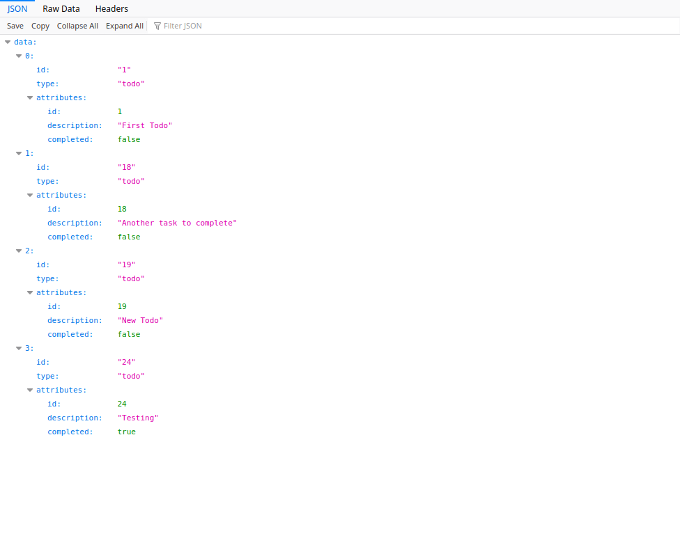
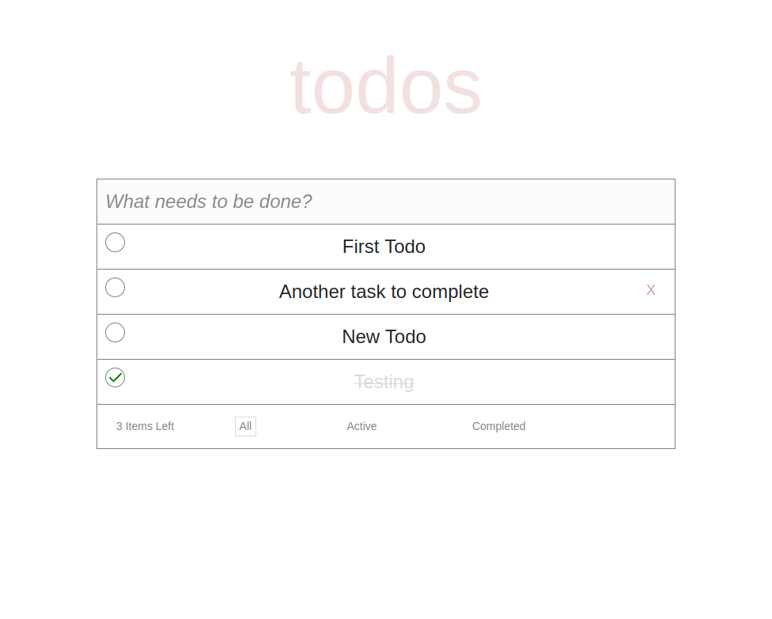

[![Contributors][contributors-shield]][contributors-url]
[![Forks][forks-shield]][forks-url]
[![Stargazers][stars-shield]][stars-url]
[![Issues][issues-shield]][issues-url]

# Rails API + React front-end Todo List

On this project, I created a simple Todo List App using RoR as a server side API and React & Redux to get data and feed the API. It allows the user to create, update, delete and change the status (between completed/active) for the Todos. On the front-end using Redux the user can filter Todos by 'All', 'Completed' or 'Active'.

#### Sample of JSON returned from API



#### Front-end Client



## Table of Contents

- [Installation](#installation)
- [Built With](#built-with)
- [Future Implementations](#future-implementations)
- [Contributing](#contributing)
- [Acknowledgments](#acknowledgments)
- [Authors](#author)
- [License](#license)

## Installation

You can get a local copy of the repository please run the following commands on your terminal:

```
$ cd <folder>
$ git clone https://github.com/Stricks1/railsReactTodo.git
```

### Server Side

The API (server side) is on the folder server. In order to run the server go to the folder run `$ bundle install` to get install the gems needed. After that we need to migrate the db with `$ rails db:migrate`, and finally you can run the server using the command `$ rails server`.
You are ready to access the API on the address `http://localhost:3000/`

#### Prerequisites for server-side

Ruby: >= 2.6.5 - Rails >=5.2.4.3

### Client Side

To get in the front-end (client side) first go to the folder client.
Run `npm install` in your terminal.
If your server side is running outside `http://localhost:3000/` you will need to do this extra step: change the constant on: `client/src/helpers/constants.js`. Open that file and change the URL where your server is running at the first line.
Run `npm start` to run on your local machine the client-side.

## Running Tests

To RoR RSpec tests we have the following files:

```
rspec spec/controllers/todos_spec.rb
rspec spec/models/todos_spec.rb
```

Front-end React Tests you can run on the client folder:

```
npm test
```

## Built With

- React
- Redux
- HTML
- CSS
- Axious
- Ruby on Rails

### Test with

- Jest
- React Testing Library
- Rspec
- Faker
- FactoryBot

## Future Implementations

In the future I would like to improve this project adding:

- graphql
- extra features such as filter by todo description, infinite scroll for loading the Todo list

## Contributing

Contributions, issues and feature requests are welcome!

You can do it on [issues page](issues/).

## Acknowledgments

This project was part of a challenge to create a [Todolist](https://github.com/gettcomex/todolist-challenge)

Special thanks to code reviewers.

## Show your support

Give a ⭐️ if you like this project!

## Author

👤 **Gabriel Malheiros Silveira**

- Github: [@Stricks1](https://github.com/Stricks1)
- Linkedin: [Gabriel Silveira](https://linkedin.com/in/gabriel-malheiros-silveira/)
- Twitter: [@Gabriel_Stricks](https://twitter.com/Gabriel_Stricks)

## License

<strong>Creative Commons 2020</strong>

<!-- MARKDOWN LINKS & IMAGES -->

[contributors-shield]: https://img.shields.io/github/contributors/stricks1/railsReactTodo.svg?style=flat-square
[contributors-url]: https://github.com/stricks1/railsReactTodo/graphs/contributors
[forks-shield]: https://img.shields.io/github/forks/stricks1/railsReactTodo.svg?style=flat-square
[forks-url]: https://github.com/stricks1/railsReactTodo/network/members
[stars-shield]: https://img.shields.io/github/stars/stricks1/railsReactTodo.svg?style=flat-square
[stars-url]: https://github.com/stricks1/railsReactTodo/stargazers
[issues-shield]: https://img.shields.io/github/issues/stricks1/railsReactTodo.svg?style=flat-square
[issues-url]: https://github.com/stricks1/railsReactTodo/issues
